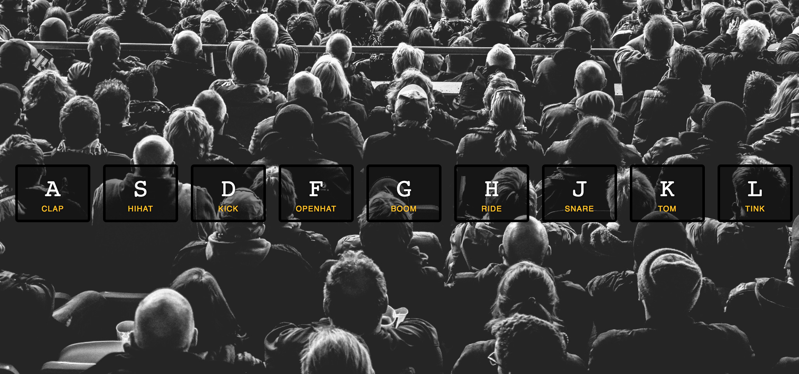

# js-drumkit
Playable drumkit using the keyboard.

## Screenshot

## Usage

Git clone the repo and open the index.html file in the browser. You can press one of the keys on your keyboard that relate to those on the screen to play a different drum sound.

## My Approach

I started by following the tutorial and making a replica of the tutorial project. It was easy to follow and included how to use sounds in the HTML, which I haven't encountered in my previous projects. Something I did differently was to put the JavaScript in a separate file so it is more manageable and the HTML file tidier.

I am used to TDDing all my projects so I immediately set about setting up Jasmine, a testing framework I have used before with JavaScript. After setting up the testing I realised that actually the project is all front end so this sort of testing isn't necessary. However I did think about front-end testing and decided to use Cypress as I have used it before and I like it.
